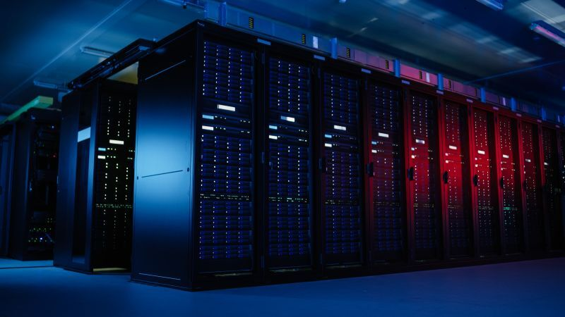
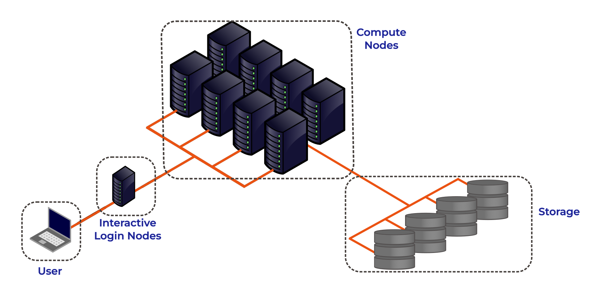

:::::::::::::::::::::::::::::::::::::: questions

- What is a High Performance Computing cluster?
- What is the difference between an HPC cluster and the cloud?
- How can an HPC cluster help me with my research?
- What HPC clusters are available to me and how do I get access to them?

::::::::::::::::::::::::::::::::::::::::::::::::

::::::::::::::::::::::::::::::::::::: objectives

- Describe the purpose of an HPC system and what it does
- List the benefits of using an HPC system
- Identify how an HPC system could benefit you
- Summarise the typical arrangement of an HPC system's components
- Differentiate between characteristics and features of HPC and cloud-based systems
- Summarise the capabilities of the NOCS HPC facilities
- Summarise the key capabilities of Iridis 6 and Iridis X for NOCS applications
- Summarise key capabilities of national HPC resources and how to access them
::::::::::::::::::::::::::::::::::::::::::::::::

## High Performance Computing

{width="100%" .noinvert}

High Performance Computing (HPC) refers to the use of powerful computers and programming techniques to solve computationally intensive tasks. An HPC cluster, or supercomputer, is one which harnesses the **aggregated** power of groups of advanced computing systems. These high performance computers are grouped together in a network as a unified system, hence the name cluster. HPC clusters provide extremely high computational capabilities, significantly surpassing that of a general personal computer.

HPC clusters fundamentally perform simple numerical computations, but on an extremely large scale. In our examples we can see where HPC clusters excel, using hundreds or thousands of processors to complete a numerical task that would take a desktop or laptop days, months or years to complete. They can also tackle problems that are too large or complex for a PC to fit in their memory, such as modelling the ocean dynamics or the Earth's climate.

**High Performance Computing allows you as researchers to scale up your computational research and data processing, enabling you to do more research or to solve problems that would be infeasible to solve on your own computer.**

## HPC vs PC
Before we discuss High Performance Computing clusters in more detail let's start with a computational resource we are all familiar with, the PC:

### PC

<table style="width:100%; border-collapse:collapse; margin-bottom:1em;">
  <tr>
    <!-- Image column -->
    <td style="width:240px; vertical-align:top; text-align:center;">
      
    </td>

    <!-- Text column -->
    <td style="vertical-align:top; padding-left:20px;">
      
Your PC is your local computing resource, good for small computational tasks. It is flexible, easy to set-up and configure for new tasks, though it has limited computational resources.

      
Let’s dissect what resources programs running on a laptop require:

      <ul>
        <li>A keyboard and/or touchpad is used to tell the computer what to do (Input)</li>
        <li>The internal computing resources Central Processing Unit (CPU) and Memory are used to perform calculations</li>
        <li>Display depicts progress and results (Output); alternatively, both input and output can be done using data stored on Disk or on a Network</li>
      </ul>

    </td>
  </tr>
</table>

### If Our PC isn't Powerful Enough?

{width="20%"}

When the task to solve becomes too computationally heavy, the operations can be out-sourced from your local laptop or desktop to elsewhere.

Take for example the task to find the directions for your next conference. The capabilities of your laptop are typically not enough to calculate that route in real time, so you use a website, which in turn runs on a computer that is almost always a machine that is not in the same room as you are. Such a remote machine is generically called a server.

The internet made it possible for these data centers to be far remote from your laptop. The server itself has no direct display or input methods attached to it. But most importantly, it has much more storage, memory and compute capacity than your laptop will ever have. However, you still need a local device (laptop, workstation, mobile phone or tablet) to interact with this remote machine.

There is a direct parallel between this and running computational workloads on HPC clusters, in that you outsource computational tasks to a remote computer.

However there is a distinct difference between the "cloud" and an HPC cluster. What people call the cloud is mostly a web-service where you can rent such servers by providing your credit card details and by clicking together the specs of a remote resource. The cloud is a generic term commonly used to refer to remote computing resources of any kind – that is, any computers that you use but are not right in front of you. Cloud can refer to machines serving websites, providing shared storage, providing web services (such as e-mail or social media platforms), as well as more traditional “compute” resources.

HPC systems are more static and rigidly structured than cloud systems, and follow consistent patterns in how they're deployed, whereas cloud infrastructures tend to be much more flexible and "user-led" in their configurations and provisioning.

### HPC Cluster

If the computational task or analysis is too large or complex for a single server, larger agglomerations of servers are used. These HPC systems are known as **supercomputers**, or described as **HPC clusters** as they are made up of a cluster of computers, or compute nodes.

Distinct to the cloud, these clusters are networked together and share a common purpose to solve tasks that might otherwise be too big for any one computer. Each individual compute node is typically a lot more powerful than any PC - i.e. more memory, many more and faster CPU cores. However in parallel to the cloud you access HPC clusters remotely, through the internet.

The figure below shows the basic architecture of an HPC cluster.

{width="80%"}

Lets go through each part of the figure:

#### Interactive Login Nodes

When you are given an account on an HPC cluster you will get some login credentials. Using these credentials you can remotely log-on to of the interactive login nodes from your local PC over the internet. There may be several login nodes, to make sure that all the users are not trying to access one single machine at the same time.

Once you have logged onto the login node you can now run HPC workloads, or jobs, on the HPC cluster. **BUT you typically do not directly access the CPU/GPU cores that do the hard work**. Supercomputers tend to operate in batch mode, where you submit your workload to a resource manager which places it in a queue (resource management and job submission will be discussed in more detail later). The login node is where you prepare and submit your HPC jobs to the queue to be scheduled to run.

The login nodes are used for:

* Interactive access point to the HPC resources.
* Transferring data onto/off the system.
* Compiling code and lightweight development tasks.
* Preparing and submitting HPC workload job scripts to the scheduler.
* Running short lightweight scripts for setup or testing.
* **Not for heavy computation** — they have limited resources, so running heavy computation here will affect other users!

#### Compute Nodes

The compute nodes are the core of the system, and provide the system resources to execute user jobs. They contain the thousands of processing units and memory, working in parallel, to run the HPC workloads. They are connected to one another through a high speed interconnect, so that the communication time between the processors on separate nodes impacts program run times as little as possible.

An HPC system may be made up of different types of compute node, for example a typical HPC system may have:

* **Batch CPU Nodes**: standard, general purpose, batch CPU nodes for executing parallel workloads. ( Tens/Hundreds of CPUs per node. Moderate RAM - hundreds of GBs)
* **High-mem**: nodes with similar CPUs to the standard nodes, but large amounts of memory (TBs of memory)
* **GPU nodes**: containing accelerators for highly parallel workloads e.g. AI training and inference, image processing and dense linear algebra.
* **Interactive/Visualisation**: nodes allowing users to run computationally intensive tasks interactively, such as data visualisation.

#### Storage

These nodes are equipped with large disk arrays to manage the vast amounts of data produced by HPC workloads. In most systems, multiple storage nodes and disk arrays are linked together to form a parallel file system, designed to handle the high input/output (I/O) demands of large-scale computations. Users do not access storage nodes directly; instead, their file systems are mounted on the login and compute nodes, allowing access to data across the cluster.

### HPC vs PC

OK, now we have had a look at what makes up the basic components of an HPC cluster let's summarise the key features and differences between your personal computer and an HPC cluster.

| **Feature**              | **Local PC**                                                                 | **HPC Cluster**                                                                                 |
|---------------------------|------------------------------------------------------------------------------|--------------------------------------------------------------------------------------------------|
| **Hardware**              | Single standalone computer                                                  | Many interconnected compute nodes forming one system                                            |
| **Processors (CPU)**       | Few cores (4–16 typical)                                                   | Many CPUs per node; hundreds or thousands of cores total across the cluster                                 |
| **Memory (RAM)**          | Limited (8–128 GB)                                                         | Large aggregated memory (hundreds GB – several TB)                                              |
| **GPU (Accelerators)**    | Typically one consumer or workstation GPU (e.g., NVIDIA RTX)                 | Typically can have multiple high-end GPUs on GPU nodes (e.g., NVIDIA A100/H100), designed for massive parallel workloads |
| **Storage**               | Local SSD/HDD; limited capacity                                            | Shared large capacity high-speed parallel file system, and local SSD on compute nodes                                    |
| **Networking**            | Standard Ethernet; used mainly for internet or file sharing                | High-speed interconnects for low-latency communication                  |
| **Maintenance**           | User-maintained                                                           | Admin-maintained; centrally monitored and secured                                               |
| **Storage Access**        | Local file access only                                                    | Shared network storage accessible to all nodes                                                  |
| **Typical Use Case**      | Small-scale data analysis, development, or prototyping                     | Large-scale simulations, data-intensive computing, ML/AI training                               |
| **User Interaction**      | Direct, interactive sessions largely GUI based                                              | Typically accessed through the command line; Batch jobs submitted to queue; limited interactive use                                          |

## The HPC Landscape

HPC facilities are divided into tiers, with larger HPC clusters being categorised in higher tiers.

{width="80%"}

In the UK there are three tiers, with an additional highest tier for continental systems:

* Tier 3: Local single institution supercomputers aimed towards researchers at one institution. At the University of Southampton we have the Iridis HPC cluster.
* Tier 2: Layer of HPC clusters that sit above the Tier 3, or University systems, and are larger or more specialised than most University systems. These are facilities that fill the gap between tier 3 and tier 1 facilities.
* Tier 1: Nationally leading HPC clusters.
* Tier 0: European facilities with petaflop systems, and the best across a continent. The Partnership for Advanced Computing in Europe (PRACE) provides access to the 8 Tier-0 systems in Europe.

As students, you will typically have access to Tier 3 resources. Access to higher tier systems is typically through a competitive access grant process.

## Local HPC Clusters

### Iridis 6, Iridis X and Iridis 7

The local tier 3 system at the University of Southampton is known as Iridis, which is comprised of the clusters known as **Iridis 6**, **Iridis X** and the new **Iridis 7**.

Iridis 6 is the University's CPU based HPC cluster, intended for running large parallel, multi-node, CPU based workloads. It comprised of 26,000+ AMD CPUs:

:::callout
**Iridis 6 Specification**

* 134 Standard Compute Nodes
    - Dual-socket AMD EPYC 9654 (2×96 cores) → 192 cores per node
    - 750 GB RAM (≈650 GB usable)
* 6 Compute Nodes (EPYC 9684X)
    - Dual-socket AMD EPYC 9684X (2×96 cores) → 192 cores per node
    - 650 GB usable memory per node
* 4 High-Memory Nodes
    - Dual-socket AMD EPYC 9654 (2×96 cores) → 192 cores per node
    - 3 TB RAM (≈2.85 TB usable)
* 3 Login Nodes
    - Dual-socket AMD EPYC 9334 (2×32 cores) → 64 cores per node
    - 64 GB RAM limit and 2 CPU per-user limit on login nodes

:::

Iridis X an hetereogeneous GPU cluster encompassing the University's GPU offering:

::: callout
**Iridis X Specification**

* AMD mi300x: 1 node — 128 CPU, 8× MI300X (192 GB each), 2.3 TB RAM
* NVIDIA H200:
    - Quad h200: 4 nodes — 48 CPU, 4× H200 (141 GB each), 1.5 TB RAM per node
    - Dual h200: 2 nodes — 48 CPU, 2× H200 (141 GB each), 768 GB RAM per node
* NVIDIA A100:
    - 12 nodes — 48 CPU (Intel Xeon Gold), 2× A100 (80 GB each), 4.5 TB RAM per node
    - 1 Maths Node (Can be scavenged when idle)
* NVIDIA L40: 1 node — 48 CPU, 8× L40 (48 GB each), 768 GB RAM
* NVIDIA L4: 2 nodes — 48 CPU, 8× L4 (24 GB each), 768 GB RAM per node
* CPU Only:
    - AMD Dual AMD EPYC 7452: : 74 nodes (64 CPU), 240 GB RAM per node
    - AMD Dual AMD EPYC 7502 Serial Partition : 16 nodes (64 CPU), 240 GB RAM per node

There is also departmental cluster within Iridis X, known as Swarm. It is for the use of the Electronics and Computer Science department, but it can be scavenged (i.e. used when idle). It contains:

* NVIDIA A100: 5 nodes — 96 CPU, 4× A100 SXM (80 GB each), 900 GB RAM per node
* NVIDIA H100: 2 nodes — 192 CPU, 8× H100 SXM (80 GB each), 1.9 TB RAM per node

:::

Iridis 7 is a new GPU cluster which is being rolled out over Autumn 2026.  Access is being opened to users while the system undergoes testing.

You can find out more details about the system from the <a href="https://sotonac.sharepoint.com/teams/HPCCommunityWiki">HPC Community Wiki</a>, and to get access to the system there is a <a href="https://sotonac.sharepoint.com/teams/HPCCommunityWiki/SitePages/Connecting-to-Iridis5.aspx"> short application form</a> to be filled in.

There is a team of HPC system adminstrators that look after Iridis, including supporting the installation and maintenence of the software you need. You can contact them through the <a href="https://teams.microsoft.com/l/team/19%3A18c8baa70f8540d78455babffe11ad9c%40thread.tacv2/conversations?groupId=a0a40f99-c620-425f-8c12-a1216cf64cce&tenantId=4a5378f9-29f4-4d3e-be89-669d03ada9d8"> HPC Community Teams</a>.

::::::::::::::::::::::::::::::::::::: keypoints

- High Performance Computing (HPC) combines many powerful computers (nodes) into clusters that work together to solve large or complex computational problems faster than a personal computer.
- HPC is essential when problems are too big, data too large, or computations too slow for a single machine.
- HPC facilities in the UK are divided into tiers: the largest systems categorised in higher tiers. The University of Southampton's HPC system is a local tier 3 facility and you can get access to use it.

::::::::::::::::::::::::::::::::::::::::::::::::
